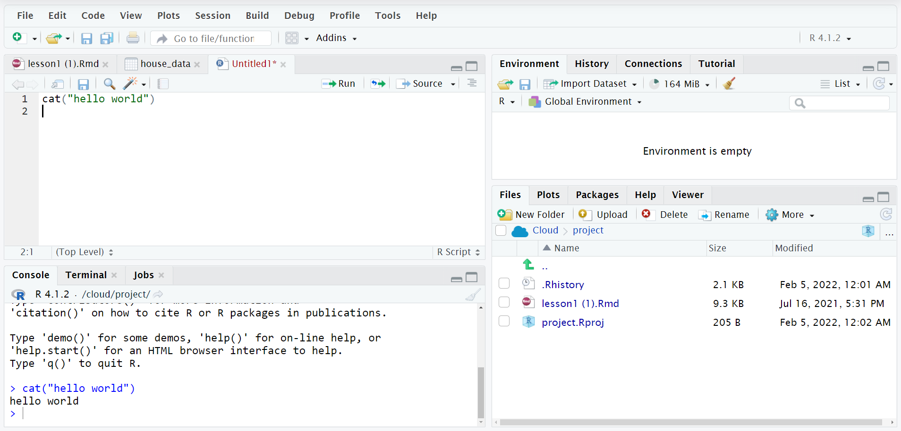

```{css, echo = FALSE}
body {
  background-color: #b6c7cf;
}
.question{
  color: red; margin-left:30px;margin-right:30px;padding:3px;padding-left:8px;
}
```

# Why use R?

R is a language designed for statistics and data analysis. It contains many built-in functions and libraries that allow us to analyse data effectively.
Additional libraries are easy to create and allow domain specific code to be share, or for users to enhance the functionality of base R. 


# Setting up R: Pre-workshop

## Local Install

The workshops will be taught using Rstudio
To install R studio you need to 

https://cran.r-project.org/

https://www.rstudio.com/products/rstudio/download/


## Using Rstudio Cloud

Go to https://rstudio.cloud/

For speed we recommend logging in using your Monash Google account.





# R basics


## Using R as a calculator


R supports a  range of mathematical operators, most application in R will involve some numeric calculation. R can be used kind of like a fancy calculator. It supports a wide range of inbuilt functions that we can use to do basic calculations when required, including square root, exponential, factorial and many more. To get used to the R interface type a few basic calculations into the console. 
```{r results = "hide"}
1+2
```
After running this with ctrl-enter (cmd-enter on Mac) you should see the console results. 
```{r echo = FALSE}
1+2
```

```{r }
40*4-10
```

Try to attempt a this simple calculation on your own:
$$
\left(\log(2) + \frac{1}{9} \right) * 8
$$
```{r}
sqrt(sin(log(2)+1/9))
```

For a full dive into how R can understand mathematical operations, functions and constants, evaluate the expression below in R:

$$
\frac{1}{2} \sqrt{1 + \cos\left({\frac{\pi}{2}}\right)} * \log(10)
$$


## Saving variables 

To save a variable we use `<-` to assign a certain number a value. These are then stored until we restart our session of R or clear our variable names We can assign a variable almost any type of data from simple numbers as in these upcoming cases to entire spreadsheet like objects, and complicated functions. 

Here we assign the radius of a circle to a value of 40.

```{r}
radius <- 40
radius
```


We can use these saved values in later calculations. 
In this example we can calculate the area of a circle with the radius from before. 
Can you create some variables in your R console? 

```{r}
circumference <- radius*pi*2
circumference
```
<div class="question" >
  <b>Question  </b>
</div>

Using the following measurements write some code that calculates the area of a rectangle 


```{r}
length <- 40
height <- 60

```


## Strings
Strings store a collection of characters such as letters or digits. Strings are declared by using either single or double quotation marks. We often use strings to represent names, places or categories. We can save and use strings in much the same way as we use integers numbers, however some operations such as addition cannot be used on strings. 

```{r}
myName <- "Josh"
```

Define a variable that is your name.

```{r}


```

## Booleans

Booleans store only true or false values.

```{r}
isfalse <- FALSE
```


Using comparison operators we can test certain conditions. Many functions will also return a boolean if the input matches the expected output. 
Here we have some examples of greater than and less than operators.
```{r}
myHeight <- 178
#if taller than 120, then attendee can go on the park ride
canRide <- myHeight > 120
canRide
```


## Vectors

Vectors are used to save a collection of variables, they can be only used to save data of the same type.

Create a vector using the c() function, this will store all variables in the same place, allowing us to reference them with a single variable in R
```{r}
numbers <- c(5,6,2,1,7)
```

<div class="question" >
  <b>Question  </b>
</div>
Write some code that saves a few numbers, say the value of some items you recently purchased.
```{r}
mypurchaces <- c()
```

Accessing specific numbers from a vector is called indexing. In R we there are a few types of indexing that we can use. The first is 
In order to take a number from a vector we must use indexing to obtain the item from the vector that is in that position
Vectors are indexed with square brackets, starting with one. 


```{r}
numbers[1]
```
note. In python we start with 0, in R we start with 1

```{r}
numbers[2:4]
```
<div class="question" >
  <b>Question  </b>
</div>
Write some code that takes the first 5 purchases from your previous saved.
```{r}

```


Logical indexing means we can obtain true or false values for each position in the vector
The following code when run will tell us which element is greater or larger than 5
```{r}
numbers>5
```

If we require a vector ranging from some start and end number, we can use the seq() function.
```{r}
vec_zero_to_five <- seq(0,5) # int[1:6] 0 1 2 3 4 5
```

### Some inbuilt functions on vectors

R has many inbuilt functions that allow us to efficiently compute statistics on vector, and manipulate objects. 

Many of the functions in R will automatically apply to all items in a vector. For example calling the function  `sqrt(c(4,9,16))` will evaluate the square root of all 3 numbers, and return a vector containing them. 

Some examples are 

```{r eval = F}
mean() #calculates the mean of the items in the vector
sd() # standard deviation 
var() # variance
plot() #plots the items
sin() #sin (other scientific functions are available)

#
exp() 
sum()

#and some statistical tests are also available
fisher.test() #Fisher exact test
binom.test() # binomial significance test
```

## Lists

Lists are similar to vectors but have a few extra added features. In lists we can store data of different sizes, and different values.
We can use lists to to store vectors that have names. In the following we store 

Lists can store any type of variable, including other lists. We can have both named an unnamed lists.

```{r}
#an example of a named list
house_sale_prices <- list("brighton"=c(1000000,340000),
                          "clayton"= c(190000,570000,4000000),
                          "frankston"= c(2000000,5000000))

```

```{r}
# an example of an unnamed list. note we put our previous list in
random_collection <- list(40,"josh",list(),house_sale_prices)

```

### Indexing Lists

Lists can be "indexed" by their names. They can also be indexed by position. Using a double bracket returns the item inside the list, while using single bracket returns a list holding the elements that have been indexed. 
```{r}
#get the prices of a certain suburb 
house_sale_prices[["clayton"]]

```

<div class="question" >
  <b>Question </b>
  
</div>


Write some code to find the mean of the house prices of each three suburbs in our toy example
```{r}

```

<br><br><br><br>

#### Spoiler
You might solve it by doing something like this


```{r class.source = 'fold-hide'}
mean(house_sale_prices[["clayton"]])
mean(house_sale_prices[["brighton"]])
mean(house_sale_prices[["frankston"]])
```

or maybe something like this if you have written some code before.

```{r class.source = 'fold-hide'}
for (suburb in names(house_sale_prices)){
  print(suburb)
  print(mean(house_sale_prices[[suburb]]))
}
```
However this involves writing a lot of error-prone code that is often slow to execute on large datasets.

In the next session we will be using dataframes along with functions from the tidyverse package to make these kinds of analysis easier to write, read and faster to run. 

## Dataframes

Most data in R is stored in dataframes

Dataframes store flat representations of data similar to a table or single spreadsheet page. 


### Reading in Data
Here we read in some data from the internet in the form of a csv 
This data is then stored in a dataframe within R where we can perform calculations on it


```{r}

house_prices <- read.csv("https://raw.githubusercontent.com/joshuajohnmills/Rworkshop/master/MelbourneHousingData.csv")

```

First we view the data

```{r eval = F}

View(house_prices)

```


Although RStudio provides indication for the number of rows and columns, these values can be retrived by the `ncol` and `nrow` functions.

```{r}
ncol(house_prices)
nrow(house_prices)
```

For further data exploration, we can view all our columns / variables through `names` or str` command

```{r}
names(house_prices)
```


We can access single columns as vectors by using the dollar sign operators
Here we find the mean of all the houses prices in the data set.

```{r}
mean(house_prices$Price)
```

When accessing data for a single variable, there are mutliple ways of going about this:

```{r eval= F}
house_prices$Price
house_prices[, "Price"] # Indexing methods
house_prices[, 5] # Column #5 is the one attributed to Price
```

<div class="question" >
  <b>Question. Display a dataframe with only `Suburb`, `Price` and `Postcode` as columns.</b> 
  <br>
  Hint: Use a combination of `c()` to concatenate variable names and the dataframe indexing method shown above
</div>
<b> Example output </b>


```{r class.source = 'fold-hide'}
head(house_prices[, c("Suburb", "Price", "Postcode")])
```

We can also combine row and column referencing. To find the 1st and 100th row of a DataFrame with columns `Suburb`, `Price` and `Postcode`, we can achieve this via:

```{r }
house_prices[c(1,100), c("Suburb", "Price", "Postcode")]
```


<div class="question" >
  <b>Question </b>
</div>

Find any data online that comes in the form of a csv that you might be interested in analyzing.
Download the .csv file and place it in a file, copy the file path.
Then use the `read.csv` function to read in the csv into R. Use the `View` function to view your data.  
You might find the function `getwd()` useful. R will automatically look in that directory (the working directory) for files.
`setwd()` will change the working directory to the functions argument, where R looks by default. 

Some good places to look are:

 - https://www.kaggle.com/ for simple and easy to use data
 - https://data.gov.au/ for data about Australia and the Government 
 - https://datasetsearch.research.google.com/ for specific dataset searches. 
 

```{r}

```


<br>
<br>

### Next session

We will be learning more about data frames next session tomorrow, we will be able to answer the following questions.

Is the price of houses increasing each year.
What are the most expensive suburbs.
Which region is the most expensive.
How can we find specific houses that match certain criteria (ie find all three bedroom houses in Clayton.)


This was created by Joshua Mills and the education committee for MDSS, thank you to the rest of the committee for allowing this workshop to be possible.  


<br>
<br>
<br>
<br>
<br>
<br>


