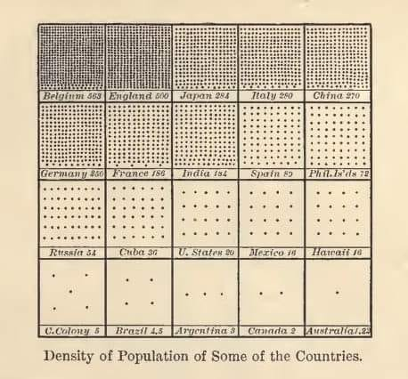
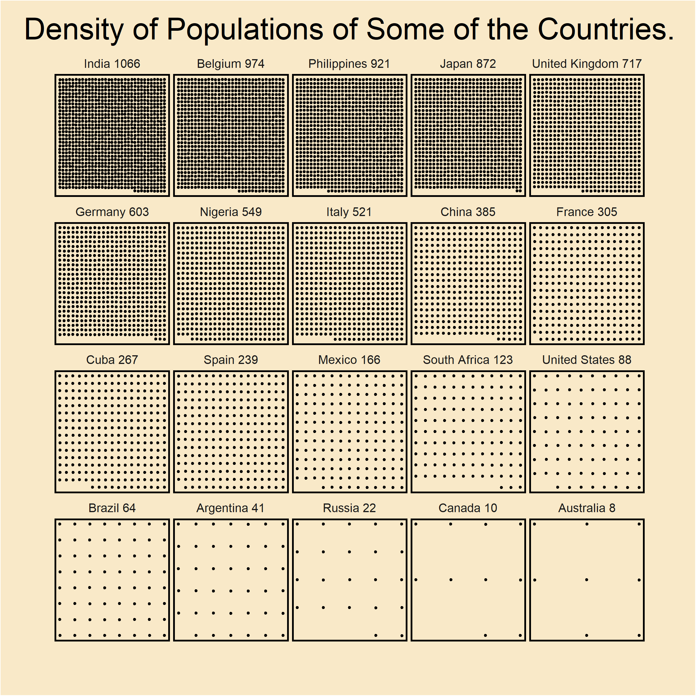

```{css, echo = FALSE}
body {
  background-color: #b6c7cf;
}
.table{
  border-radius: 3px;
  background: #f5f5f5;
  padding: 25px;
}
.odd{
  background: #ffffff;
}
.question{
  color: red; margin-left:30px;margin-right:30px;padding:3px;padding-left:8px;
}
```
# Graphing 


Welcome back to the third workshop. Today we are focusing on graphics produced by ggplot. 

Ggplot is a library used to create graphics in R. It is one of the most popular static graph libraries, and has libraries that allows animations and interactive graphics to be created from Ggplot objects. 

Ggplot works by layering geometric objects onto a base object. 

We start by creating a base object using the `ggplot()` function. 
And then we can add data, define mappings from that data to the output, and finally add the geometries we are looking for. 

This might sound complicated at first, but once you get used to it you can create diverse and highly customized graphics with ease. 

We will use some very simple data here to illustrate how to use some basic ggplot functions. 


We start by installing and loading in the entire tidyverse group of packages
This will automatically load dplyr, ggplot, tidyr, magrittr and multiple other packages into your r session.
```{r, eval = F}
install.packages("tidyverse")
```


```{r, results= 'hide',message=FALSE}
library(tidyverse)
```


```{r, results= 'hide',message=FALSE}
#use the same functions as yesterday
housing_data <- readr::read_csv("https://raw.githubusercontent.com/joshuajohnmills/r/master/MelbourneHousingData.csv")
```

```{r}
richmond_houses <- housing_data %>% 
  drop_na(BuildingArea,Bedroom2,) %>% 
  filter(Suburb == "Richmond",Bedroom2 > 0,Landsize > 0)  %>% 
  select(Type,Bedroom2,Price,BuildingArea) %>% 
  mutate(Type = as.factor(Type))
```
*note* Factors are used to specify that strings denote categorical variables, instead of plain text. Using factors allows R to more effectively store categorical data and communicate the fact that the data is categorical to functions. 
 

```{r eval = FALSE}
View(richmond_houses)
```

## Constructing a basic plot

Aesthetics tell ggplot what elements of the data to map onto what items in the output. This is like telling the X-axis to be based on one feature, the y based on another and the color to be based on the third.

In the following we will investigate how size of the house influences sale prices in Richmond. 

We start by create a base plot. This plot has nothing on it, but refers to the data. 


```{r}
myplot <-  ggplot(data = richmond_houses)
myplot
```

Here we add the mapping, this tells ggplot what should be on either axis. 
```{r}
myplot <-  ggplot(data = richmond_houses, aes(x = BuildingArea,y= Price))
myplot
```
Next we will add points to the data. Here we use the `geom_point` to 


```{r}
myplot <-  ggplot(data = richmond_houses, aes(x = BuildingArea,y=Price))+
  geom_point()
myplot
```
We can see that as the building area gets larger, the prices generally increases. 

<div class="question" >
  <b> Question  </b>

</div>

 1. Create a scatter chart that has any two other variables on the x and y axis

 2. Investigate how to create a scatter chart with different sized or coloured points. The size or colour should be based on the data. 
 
 <br>
 *hint* add something to the aes function


### Different Geoms

There are many types of plots that can be made with ggplot, far too many to be discussed here. In this session we explictly talk only about a small subset of the plots.

To read all the geoms that ggplot implements read here: 

https://ggplot2.tidyverse.org/reference/

There are also many packages that extend the capabilities of ggplot for visuals that are specific to other fields. 


### Line plots

Line plots work well with timeseries data. In this example we investigate whether the price of properties have increased over time.  


```{r, ,message=FALSE, results= 'hide'}
if(!require(lubridate)){
  install.packages("lubridate")
  library(lubridate)
}
```

Here we create a data frame that contains the average sale price for each month.
 
```{r}
time_trends <- housing_data %>% 
  group_by(Month = floor_date(as.POSIXct(Date,format="%d/%m/%Y"),"month")) %>% 
  summarise(Price = mean(Price)) 
```


```{r eval = FALSE}
View(time_trends)
```

Here we use geom line to create a lineplot. 
In the `aes` function we specify exactly what we want from the data. 


```{r}
ggplot(time_trends, aes(x=Month, y=Price)) +
    geom_line()
```
We have a generally increasing trend with July 2017 being an anomolously low month.

<div class="question" >
  <b> Question  </b>

</div>

Using the following code, create the same line chart, but with a single line for each region. 

*hint* use the `col =` in the aes function 
<br>

```{r}
time_trends2 <- housing_data %>% 
  group_by(Month = floor_date(as.POSIXct(Date,format="%d/%m/%Y"),"month"), Regionname) %>% 
  summarise(Price = mean(Price)) 
```


```{r eval = FALSE}
View(time_trends2)
```


```{r}

```


### Boxplots

In our data we have a column called "Type" this is u for unit, h for house and t for townhouse. 
In the following example we expand this using a `case_when` function and then use ggplot to create a boxplot. 

Note the `aes` can go in either the main `ggplot` function or in the `geom_*` function.

We can even compose a graph with different `aes` on each geom. 

```{r}
housing_data <- housing_data %>% mutate(FullType = case_when(Type == 'u'~ "Unit",
                                                             Type == 't'~ "Townhouse",
                                                             Type == 'h'~ "House"))

p<- ggplot(housing_data)+geom_boxplot(aes(x =FullType ,y= Price))
p
```


<div class="question" >
  <b> Question  </b>
</div>

Have a look at the full list of geoms that we can create in ggplot. 

https://ggplot2.tidyverse.org/reference/


## Faceting

Faceting produces small multiples, single charts for each segment. 
Here we use `facet_wrap()`, there are also other `facet_*` functions that let us change the layout of the facets.


```{r}
p<- ggplot(housing_data)+geom_boxplot(aes(x =FullType ,y= Price))+facet_wrap(~Regionname)+ylim(0,3e6)
p
```


<div class="question" >
  <b> Question  </b>

</div>

Use Facet wrap to produce small multiples for any graph from before. 

## Themes

Ggplot contains a number of different themes to customise the appearance of your plots.
You can use this to produce custom graphics. 

Here is an example. 


```{r}
ForGraph <- housing_data %>%
  group_by(Suburb) %>%
  summarise(AvePrice = mean(Price),Count = n()) %>%
  arrange(desc(AvePrice)) %>% 
  filter(Count > 10) %>% 
  head(10)
```
```{r}
HousePricePlot <- ggplot(ForGraph,aes(x=reorder(Suburb,desc(AvePrice)),y=AvePrice)) + geom_bar(stat="identity",fill="steelblue") +
    theme_classic()+
    theme(axis.text.x = element_text(angle = 60, hjust=1),
        axis.title.x=element_blank(),
        axis.ticks.x =element_blank(),
        plot.title = element_text(hjust = 0.5,vjust = 1)) +
  ylab("Average House Sale Price")+
  scale_y_continuous(expand = c(0,0),labels=scales::dollar_format())+
  ggtitle("Most expenisve suburbs in Melbourne") 
```
```{r}
HousePricePlot
```

<div class="question" >
  <b> Question  </b>

</div>
Ggplot contains many inbuilt themes. Save any of the previous graphs in a variable using `<-` and then add a theme to it.

Some inbuilt themes include `theme_minimal()`, `theme_linedraw()`, `theme_dark()`.

The `theme()` function allows us to make changes to very specific parts of a plot. 


## Saving a plot

Use the `ggsave` function to save a high quality image onto your hard disk for later.
Here we are saving the last plot as housing_type.png


```{r}
ggsave("housing_type.png", p)
```

<div class="question" >
  <b> Question  </b>

</div>

Save any of the previously produced charts. 

## Additional miscellaneous Graphics 


```{r, eval=F}
download.file("https://data.gov.au/data/dataset/af33dd8c-0534-4e18-9245-fc64440f742e/resource/3b946968-319e-4125-8971-2a33d5bf000c/download/vic_loc_polygon_shp.zip" , destfile="DATA/suburb_shape_file.zip")
unzip("DATA/suburb_shape_file.zip",exdir = "/DATA/suburb_shape_file")
```


```{r}
library(sf)
sf_df <- st_read("/DATA/suburb_shape_file/VIC_LOC_POLYGON_shp/vic_localities.shp")

average_price <- housing_data %>% filter(Longtitude<146,Longtitude>144, ) %>% group_by(Suburb) %>% summarise(mean_price =mean(Price))

data_final<- left_join(sf_df,average_price, by =c( "LOC_NAME" ="Suburb"))

plt <- ggplot()+
  geom_sf(data = data_final,aes(geometry=geometry,fill=mean_price),col="black")+
  xlim(c(144.35,145.85))+
  ylim(c(-38.2,-37.4))+
  theme_void()+
  theme(panel.background = element_rect("lightblue"),
        legend.position = "none")+
  scale_fill_gradient(
    low = "yellow",
    high = "red",
    space = "Lab",
    na.value = "grey50",
    guide = "colourbar",
    aesthetics = "fill"
  )
plt
#ggsave("map.pdf",plt)
```


```{r}
plt2 <-  ggplot()+
  geom_sf(data = data_final,aes(geometry=geometry),fill = "#f6f7e1",col="black",size = 0.02)+
  xlim(c(144.75,145.25))+
  ylim(c(-37.95,-37.75))+
  geom_point(data = housing_data %>% filter(YearBuilt>1800),mapping = aes(x=Longtitude,y=Lattitude,col = (2022- YearBuilt)),size = 0.003,alpha = 0.5)+
  theme_void()+
  theme(panel.background = element_rect("lightblue"))+
  scale_colour_gradient(
    low = "green",
    high = "red",
    space = "Lab",
    na.value = "grey50",
    guide = "colourbar",
    aesthetics = "col"
  )
plt2

#ggsave("map2.pdf",plt2)
```





```{r, class.source = 'fold-hide',results= 'hide'}
library(tidyverse)
library(janitor)
library(httr)
library(XML)
#create the data


Countries <- c("Belgium","United Kingdom","Japan","Italy","China","Germany","France","India","Spain","Philippines","Russia","Cuba","United States","Mexico",'Nigeria',"South Africa","Brazil","Argentina","Canada","Australia")

url <- "https://en.wikipedia.org/wiki/List_of_countries_and_dependencies_by_population_density"

r <- GET(url)

doc <- readHTMLTable(
  doc=content(r, "text"))

density_table <- doc[[1]]

density_table <- density_table %>% row_to_names(row_number = 1)

density_table <- density_table[2:nrow(density_table),]

names(density_table) <- c("country","population","area_mi","area_km","pop_km","pop_mi","source_year")

density_table<- density_table %>% mutate(country = gsub('\\*.*',"",country))

density_table <-  density_table %>% mutate(source_year = str_match(source_year,"\\d{4}"))

density_table <- density_table %>% mutate(country = str_trim(country))

final_table <- density_table %>% filter(country %in% Countries) %>% select(country,pop_mi)

#Create points

data <- final_table %>%
  mutate(
    pop_mi = as.numeric(gsub(",","",pop_mi)),
    sqrt = sqrt(pop_mi)
    ) %>% 
  mutate(
    r1 = ceiling(sqrt),
    r2 = floor(sqrt),
    total = r1*r2,
    r2 = ifelse(total<pop_mi,r2+1,r2),
    total = r1*r2
  ) %>%
  rowwise() %>% 
  mutate(
    points = list(expand.grid(1:r1,1:r2))
  ) %>%
  ungroup() %>% 
  mutate(
    points = map2(pop_mi,points,~.y[(nrow(.y)-.x+1):nrow(.y),])
  ) %>% 
  select(country,pop_mi,r1,r2,points) %>% 
  unnest(points) %>% 
  mutate(country = paste(country,pop_mi),
         country = fct_reorder(country,- pop_mi),
         Var1 = (Var1-1)/(r1-1),
         Var2 = (Var2-1)/(r2-1)) 

#create plot

p <- data %>% ggplot()+
  geom_point(aes(x=Var1,y=Var2),size = 0.8,position = position_jitter(0.001,0.001))+
  facet_wrap(~country)+
  ggtitle("Density of Populations of Some of the Countries.")+
  theme(strip.placement = "inside",
        strip.text = element_text(size=10),
        legend.title=element_blank(),
        legend.text=element_text(size=7),
        panel.spacing = unit(0.2, "lines"),
        plot.background = element_rect(fill="#f9e9c8"), 
        panel.background=element_rect(fill = NA),
        panel.grid.major = element_blank(),
        panel.grid.minor = element_blank(),
        axis.ticks = element_blank(),
        axis.text=element_blank(),
        axis.title = element_blank(),
        panel.border = element_rect(colour = "black", fill=NA, size=1.3),
        strip.background = element_blank(),
        plot.title = element_text(hjust =0.5,size = 25),
        plot.margin = unit(c(0.5, 1.5, 1.5, 1.5), "cm")
        )
#show plot

ggsave(paste0(getwd(),"//","recreate.png"),p,width = 8,height=8)

```



Some plots online that have been made in R


https://www.reddit.com/r/dataisbeautiful/comments/set5tk/how_long_ago_were_the_hottest_and_coldest_years/hulb705/


https://www.reddit.com/r/dataisbeautiful/comments/set5tk/how_long_ago_were_the_hottest_and_coldest_years/hulb705/


https://www.reddit.com/r/dataisbeautiful/comments/snlle0/four_periods_of_equal_sized_global_fossil_fuel/


